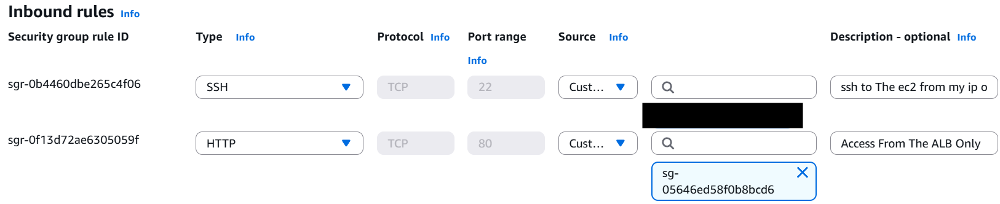

# 🛠️ Terraform AWS Infrastructure Project

## 📖 Overview

This project uses **Terraform** to build a fully functional infrastructure on **AWS**, following a two-tier architecture:

- **Proxy Servers** in **Public Subnets** behind a **Public ALB**
- **Backend Servers** in **Private Subnets** behind an **Internal ALB**
- **NAT Gateway** to provide internet access to private instances
- **Security Groups** to control traffic between components

---

## 📸 Architecture Diagram


---

## 📁 Project Structure

```
.
├── backend.tf               # S3 backend configuration
├── main.tf                  # Core infrastructure code
├── output.tf                # Outputs
├── provider.tf              # AWS provider settings
├── variables.tf             # Input variables
├── proxy_script.sh          # Optional script for proxy setup
├── terraform.tfstate        # Local state (use remote in production)
├── terraform.tfstate.backup # Backup of state
├── .terraform.lock.hcl      # Provider version lock
├── Terraform AWS...gif      # Architecture Diagram
├── modules/                 # Reusable infrastructure modules
│   ├── backend-instance/
│   ├── proxy-server-mod/
│   ├── VPC-mod/
│   ├── pub-subnet-mod/
│   ├── prv-subnet-mod/
│   ├── public-rt-mod/
│   └── private-rt-mod/
```

---

## 🧰 Tools & Technologies

- **Terraform v1.x**
- **AWS Services**:
  - VPC / Subnets
  - Internet Gateway / NAT Gateway
  - Route Tables
  - EC2 Instances
  - Application Load Balancers (ALB)
  - Security Groups
  - S3 (for remote state)

---

## 🧱 Infrastructure Components

- **VPC CIDR**: `10.0.0.0/16`
- **SUBNETS**:

| Subnet      | Type    | Component                           | Availability Zone |
|-------------|---------|-------------------------------------|-------------------|
| Subnet 1    | Public  | Reverse Proxy Server                | us-east-1a        |
| Subnet 2    | Public  | Reverse Proxy Server                | us-east-1b        |
| Subnet 3    | Private | BackEnd Web Server                  | us-east-1a        |
| Subnet 4    | Private | BackEnd Web Server                  | us-east-1b        |

---
- **NAT Gateway** in `public-subnet-1`
- **Internet Gateway** attached to the VPC
- **Load Balancers**:
  - Public ALB → Proxy EC2 instances
  - Internal ALB → Backend EC2 instances
- **Security Groups**:
  - `proxy_server_SG`: allows HTTP (80) & SSH (22) from anywhere
  - `private_server_SG`: allows HTTP & SSH only from within the VPC

---

## 🚀 Deployment Steps

### 1. Requirements

- AWS CLI configured with appropriate credentials
- Terraform installed (v1.12+)
- An SSH key pair created and its **public key** placed in the Terraform config

### 2. Initialize Terraform

```bash
terraform init
```

### 3. Validate the configuration

```bash
terraform validate
```

### 4. Preview changes

```bash
terraform plan
```

### 5. Deploy the infrastructure

```bash
terraform apply
```

### 6. Destroy the environment

```bash
terraform destroy
```

---

## 🔐 Security Details

- **Proxy Servers**:
  - Open to the internet on HTTP (80) and SSH (22)
- **Backend Servers**:
  - Accessible only within the VPC (CIDR: 10.0.0.0/16)
- **NAT Gateway**:
  - Allows internet access for private instances without exposing them publicly

---

### 🔐 Security Group Rules

| Component     | Inbound Rules                                 | Outbound Rules                  |
|---------------|-----------------------------------------------|---------------------------------|
| **FrontALB**  | Allow HTTP (80) from anywhere                 | Default (All traffic)           |
| **Proxy**     | Allow HTTP (80) / ssh from Front ALB SG only  | Default (All traffic)           |
| **BE-ALB**    | Allow HTTP (80) from Front ALB SG only        | (no outbound needed)            |
| **WEB SERVER**| Allow HTTP (80) / ssh from Front ALB SG only  | (no outbound needed)            |

FrontALB Security Group


---

## 📎 Notes

- Make sure your SSH key used in `aws_key_pair` matches the key on your local machine
- Consider using **S3 + DynamoDB** for remote backend in production environments
- The `proxy_script.sh` can be used to configure packages like nginx or HAProxy

---

